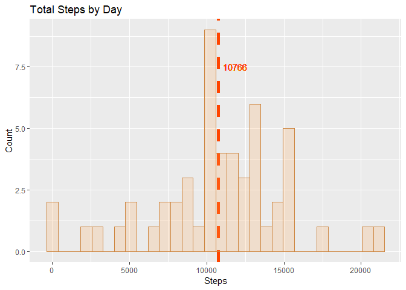
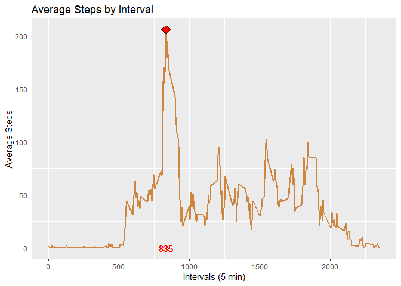
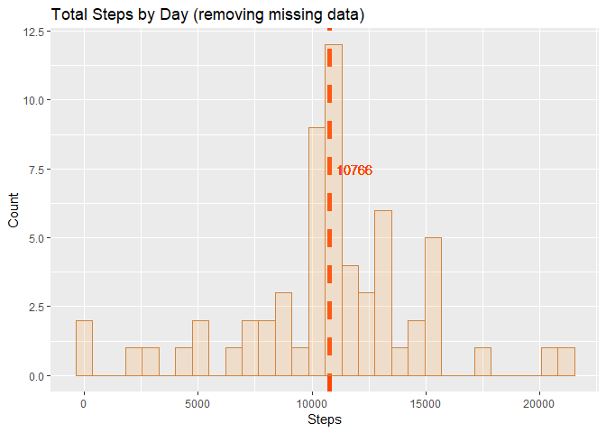
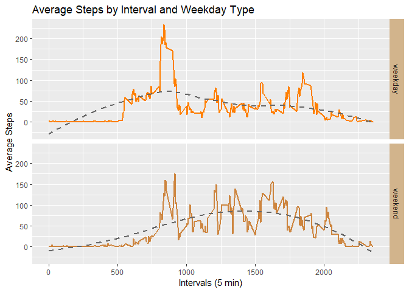

*This assignment makes use of data from a personal activity monitoring device. This device collects data at 5 minute intervals through out the day. The data consists of two months of data from an anonymous individual collected during the months of October and November, 2012 and include the number of steps taken in 5 minute intervals each day.*


### Load and preprocess the data

* Data found at <https://d396qusza40orc.cloudfront.net/repdata%2Fdata%2Factivity.zip>
* Load data from the web and read it. 
* Take a look at first rows and variables.
* Transform data if needed


```r
# download file
    download.file("https://d396qusza40orc.cloudfront.net/repdata%2Fdata%2Factivity.zip", 
        destfile = "activity.zip", mode = "wb")
# unzip data
    unzip("activity.zip")
    activityData <- read.csv("activity.csv", header = TRUE)
    head(activityData)
```

```
##   steps       date interval
## 1    NA 2012-10-01        0
## 2    NA 2012-10-01        5
## 3    NA 2012-10-01       10
## 4    NA 2012-10-01       15
## 5    NA 2012-10-01       20
## 6    NA 2012-10-01       25
```

```r
    str(activityData)
```

```
## 'data.frame':	17568 obs. of  3 variables:
##  $ steps   : int  NA NA NA NA NA NA NA NA NA NA ...
##  $ date    : Factor w/ 61 levels "2012-10-01","2012-10-02",..: 1 1 1 1 1 1 1 1 1 1 ...
##  $ interval: int  0 5 10 15 20 25 30 35 40 45 ...
```

```r
# convert date to date class
    activityData$date <- as.Date(as.character(activityData$date))
    str(activityData$date)
```

```
##  Date[1:17568], format: "2012-10-01" "2012-10-01" "2012-10-01" "2012-10-01" "2012-10-01" ...
```
##### Variables in activityData:
- *steps: Number of steps taking in a 5-minute interval (missing values are coded as NA)*
- *date: The date on which the measurement was taken in YYYY-MM-DD format*
- *interval: Identifier for the 5-minute interval in which measurement was taken*

### Calculate the mean total number of steps taken per day, ignoring missing values.

* Calculate total steps by day

```r
# group by day and sum steps
    dailySteps <- aggregate(activityData$steps, by=list(activityData$date), sum)
    names(dailySteps) <- c("date", "steps")
    head(dailySteps)
```

```
##         date steps
## 1 2012-10-01    NA
## 2 2012-10-02   126
## 3 2012-10-03 11352
## 4 2012-10-04 12116
## 5 2012-10-05 13294
## 6 2012-10-06 15420
```

* Create histogram of total steps taken by day 

```r
# load ggplot2 library
library(ggplot2)
    stepsTotalPlot <- ggplot(dailySteps, aes(x=steps)) +
        geom_vline(aes(xintercept = mean(steps, na.rm = TRUE)), color = "orangered", 
            size=2,linetype="dashed") +
        geom_histogram(color="tan3", fill ="tan1", alpha = .2) +
        labs(title = "Total Steps by Day", x = "Steps", y = "Count") +
        geom_text(aes(
            label = as.character(round(mean(dailySteps$steps, na.rm = TRUE))), 
            y = 7.5,
            x= mean(dailySteps$steps, na.rm = TRUE)), hjust = -.2, color = "orangered")

    stepsTotalPlot
```

```
## `stat_bin()` using `bins = 30`. Pick better value with `binwidth`.
```

```
## Warning: Removed 8 rows containing non-finite values (stat_bin).
```

<!-- -->

* Calculate the mean and median of total steps taken by day


```r
    summary(dailySteps$steps)
```

```
##    Min. 1st Qu.  Median    Mean 3rd Qu.    Max.    NA's 
##      41    8841   10765   10766   13294   21194       8
```

```r
# disable scientif notation
    options(scipen=999)
```

*$\color{red}{Mean}$ of total daily steps: $\color{red}{10766}$*  
*$\color{red}{Median}$ of total daily steps : $\color{red}{ 10765 }$*

### Calculate the average daily activity pattern.

* Make a time series plot (i.e.type="l") of the 5-minute interval (x-axis) and the average number of steps taken, averaged across all days (y-axis)

```r
    intervalMean <- aggregate(activityData$steps, by = list(activityData$interval), 
        mean, na.rm=TRUE)
    names(intervalMean) <- c("interval", "stepsAvg")
    head(intervalMean)
```

```
##   interval  stepsAvg
## 1        0 1.7169811
## 2        5 0.3396226
## 3       10 0.1320755
## 4       15 0.1509434
## 5       20 0.0754717
## 6       25 2.0943396
```

```r
    intervalPlot <- ggplot(data = intervalMean, aes(x= interval, y = stepsAvg))+
        geom_line(color = "tan3", size = 1) +
        labs(title = "Average Steps by Interval", x = "Intervals (5 min)", y = "Average Steps") +
        geom_text(aes(label =intervalMean$interval[which.max(intervalMean$stepsAvg)],
            x=intervalMean$interval[which.max(intervalMean$stepsAvg)], y=0 ),color = "red") +
        geom_point(aes(x=intervalMean$interval[which.max(intervalMean$stepsAvg)], 
            y = intervalMean$stepsAvg[which.max(intervalMean$stepsAvg)]), 
            shape = 23, fill = "red",  size = 4) 
    
    intervalPlot
```

<!-- -->

* Calculate Interval with maximun average number of steps.


```r
    topInterval <- intervalMean[which.max(intervalMean$stepsAvg),]
    topInterval
```

```
##     interval stepsAvg
## 104      835 206.1698
```

*Interval $\color{red}{835 }$ has the greatest average steps taken or $\color{red}{206 }$ steps.*

### Imputing missing values

* Calculate the total number of missing values in the dataset (i.e. the total number of rows with NAs)


```r
    naCount = sum(!complete.cases(activityData))
    naCount
```

```
## [1] 2304
```

*The total number of missing values is $\color{red}{2304 }$*

* Devise a strategy for filling in all of the missing values in the dataset. 
* And create new dataset with missing data filled in.


```r
# load library dplyr for pipping
    library(dplyr)
```

```
## Warning: package 'dplyr' was built under R version 3.5.2
```

```
## 
## Attaching package: 'dplyr'
```

```
## The following objects are masked from 'package:stats':
## 
##     filter, lag
```

```
## The following objects are masked from 'package:base':
## 
##     intersect, setdiff, setequal, union
```

```r
# check percentage of missing values 
    mean(is.na(activityData$steps))
```

```
## [1] 0.1311475
```

```r
# group by date and interval, get mean, then replace NA in new step column
    replaceNa <- function(x) replace(x, is.na(x), mean(x, na.rm=TRUE))
    noNaActivityData <- activityData %>%
        group_by(interval) %>%
        mutate(noNaSteps = replaceNa(steps))
```

```
## Warning: package 'bindrcpp' was built under R version 3.5.2
```

```r
    head(noNaActivityData)
```

```
## # A tibble: 6 x 4
## # Groups:   interval [6]
##   steps date       interval noNaSteps
##   <int> <date>        <int>     <dbl>
## 1    NA 2012-10-01        0    1.72  
## 2    NA 2012-10-01        5    0.340 
## 3    NA 2012-10-01       10    0.132 
## 4    NA 2012-10-01       15    0.151 
## 5    NA 2012-10-01       20    0.0755
## 6    NA 2012-10-01       25    2.09
```

```r
# confirm no null in new steps column
    mean(is.na(noNaActivityData$noNaSteps))
```

```
## [1] 0
```

```r
# create new dataset with no missing values
    newActivityData <-noNaActivityData[2:4]
    head(newActivityData)
```

```
## # A tibble: 6 x 3
## # Groups:   interval [6]
##   date       interval noNaSteps
##   <date>        <int>     <dbl>
## 1 2012-10-01        0    1.72  
## 2 2012-10-01        5    0.340 
## 3 2012-10-01       10    0.132 
## 4 2012-10-01       15    0.151 
## 5 2012-10-01       20    0.0755
## 6 2012-10-01       25    2.09
```

* Make a histogram of the total number of steps taken each day.


```r
    # group by day and sum steps
    newDailySteps <- aggregate(newActivityData$noNaSteps, by=list(newActivityData$date), sum)
    names(newDailySteps) <- c("date", "steps")
    head(newDailySteps)
```

```
##         date    steps
## 1 2012-10-01 10766.19
## 2 2012-10-02   126.00
## 3 2012-10-03 11352.00
## 4 2012-10-04 12116.00
## 5 2012-10-05 13294.00
## 6 2012-10-06 15420.00
```

```r
    # create histogram of total steps average by day
    newStepsTotalPlot <- ggplot(newDailySteps, aes(x=steps)) +
        geom_vline(aes(xintercept = mean(steps, na.rm = TRUE)), color = "orangered", 
            size=2,linetype="dashed") +
        geom_histogram(color="tan3", fill ="tan1", alpha = .2) +
        labs(title = "Total Steps by Day (removing missing data)", x = "Steps", y = "Count") +
        geom_text(aes(
            label = as.character(round(mean(newDailySteps$steps, na.rm = TRUE))), 
            y = 7.5,
            x= mean(newDailySteps$steps, na.rm = TRUE)), hjust = -.2, color = "orangered")
    newStepsTotalPlot
```

```
## `stat_bin()` using `bins = 30`. Pick better value with `binwidth`.
```

<!-- -->


* Calculate the mean and median total number of steps taken per day. 


```r
    summary(newDailySteps$steps)
```

```
##    Min. 1st Qu.  Median    Mean 3rd Qu.    Max. 
##      41    9819   10766   10766   12811   21194
```

*$\color{red}{Mean}$ of total daily steps: $\color{red}{10766}$*  
*$\color{red}{Median}$ of total daily steps : $\color{red}{ 10766 }$*

* Do these values differ from the estimates from the first part of the assignment? 


```r
    meanDiff <- mean(newDailySteps$steps) - mean(dailySteps$steps, na.rm = TRUE)
    meanDiff
```

```
## [1] 0
```

```r
    medianDiff <- median(newDailySteps$steps) - median(dailySteps$steps, na.rm = TRUE)
    medianDiff
```

```
## [1] 1.188679
```

```r
    medianDiffPerc <- medianDiff/ median(dailySteps$steps, na.rm = TRUE)
    medianDiffPerc
```

```
## [1] 0.0001104207
```

* What is the impact of imputing missing data on the estimates of the total daily number of steps?

*No impact *
 
### Verify if there are diffences in Activity Pattern between weekdays and weekends

* Create a new factor variable in the dataset with two levels - "weekday" and "weekend" indicating whether a given date is a weekday or weekend day.


```r
    activityDataWeekday <- activityData %>%
        mutate(weekDay = weekdays(date),
        weekDayType = ifelse(weekdays(date) %in% c("Saturday", "Sunday"), 
        "weekend", "weekday"))
    head(activityDataWeekday)
```

```
##   steps       date interval weekDay weekDayType
## 1    NA 2012-10-01        0  Monday     weekday
## 2    NA 2012-10-01        5  Monday     weekday
## 3    NA 2012-10-01       10  Monday     weekday
## 4    NA 2012-10-01       15  Monday     weekday
## 5    NA 2012-10-01       20  Monday     weekday
## 6    NA 2012-10-01       25  Monday     weekday
```

* Make a panel plot containing a time series plot of the 5-minute interval (x-axis) and the average number of steps taken, averaged across all weekday days or weekend days (y-axis). 


```r
# create table for weekday, interval and steps
    weekDaySteps <- aggregate(activityDataWeekday$steps,by =list(activityDataWeekday$weekDayType,
        activityDataWeekday$interval), mean, na.rm=TRUE)
    names(weekDaySteps) <- c("weekDayType", "interval", "steps")
    head(weekDaySteps)
```

```
##   weekDayType interval     steps
## 1     weekday        0 2.3333333
## 2     weekend        0 0.0000000
## 3     weekday        5 0.4615385
## 4     weekend        5 0.0000000
## 5     weekday       10 0.1794872
## 6     weekend       10 0.0000000
```

```r
# calculate summary for weekdays:
    weekdaysSummary <- summary(weekDaySteps$steps[which(weekDaySteps$weekDayType == "weekday")])
    weekdaysSummary
```

```
##    Min. 1st Qu.  Median    Mean 3rd Qu.    Max. 
##   0.000   2.218  23.974  35.338  51.872 234.103
```

```r
# calculate summary for weekendss:
    weekendSummary <- summary(weekDaySteps$steps[which(weekDaySteps$weekDayType == "weekend")]) 
    weekendSummary
```

```
##    Min. 1st Qu.  Median    Mean 3rd Qu.    Max. 
##   0.000   1.107  32.036  43.078  75.571 175.000
```

```r
# create time series plot
    weekDayPlot <- ggplot(weekDaySteps, aes(x = interval, y = steps, color = weekDayType)) +
        geom_line(size = 1) +
        scale_color_manual(values = c("darkorange1", "tan3")) +
        facet_grid(weekDayType~.) +
        labs(title = "Average Steps by Interval and Weekday Type", x = "Intervals (5 min)", 
        y = "Average Steps") +
        theme(legend.position = "none") +
        theme(strip.background = element_rect(fill = "tan")) +
        geom_smooth(method = "loess", se = FALSE, color = "gray40", size = 1, linetype = 2)
    weekDayPlot
```

<!-- -->

### Conclusion:

##### Comparing plots above for average steps taken on weekdays versus weekends, we notice: 
* From zero up to around interval 500 there are no steps in both groups. That lead us to believe interval zero to 500 corresponds to "sleeping time" (perhaps 10:00 pm through 6:30 am?), when most people are not walking.  
* Weekends: walking on weekdays seems much more concentrated betwenn interval 500 and 900, with peak 835 (in the morning, increasing until around lunch time, when it reaches its peak - If we consider interval 0 corresponding to 10:00 pm, then high activity happens something between 6:30 am and noon). Slows down after that, with a second but small peak around interval 1800.  
* Weekends: walking pattern on the weekends is shifted to the right - most people seem to wake up and start moving later compared to weekdays. And several peaks throughout the day, but none in particular, activity is more spread out through the day, compared to weekdays. 
* Average total steps taken on weekends seem to be 0.22 greater than weekdays.
